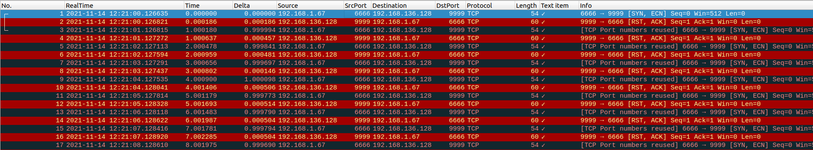
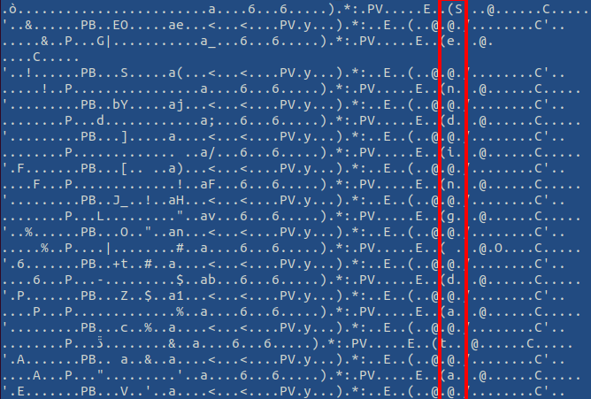
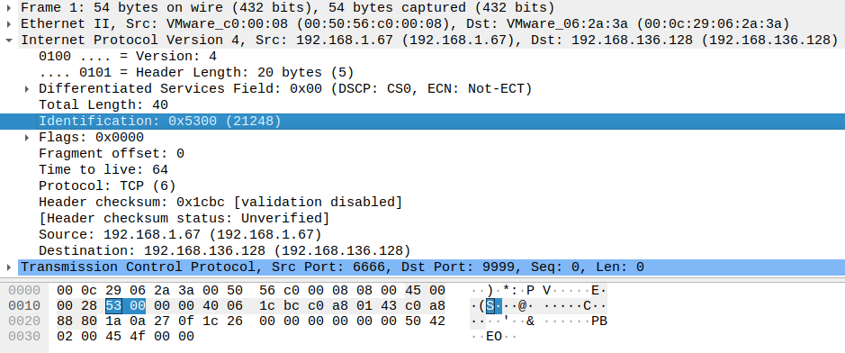

# Day 6. Weird Traffic

> Santa and his elfs noticed some weird traffic on their network. They captured the TCP data that was sent. The elfs think that the flag might have been exfiltrated.

[weird_traffic.pcap](./weird_traffic.pcap)

## Solution

PCAP file is a dump of network packets, so we use [Wireshark](https://www.wireshark.org/) to check contents.



Unfortunately, packets themselves do not contain useful payload. In fact, all we see is SYN packets immediately followed by RST packets -- TCP connection not even established. We have 102 packets in total, which might give an idea that each symbol of the flag has been encoded in this pair of SYN+RST packets.

Let's not dive into that. The challenge is actually easy. One can open the file as a text, and an attentive eye will catch this:


Offsets of the first characters of the message (`S` and `e`) are `0x3a` and `0xcc`, respectively. The next characters are followed with the fixed interval, so we can extract whole message with [this simple script](./solution.py):

```
$ ./solution.py
Sending data...
ctf{C0v3rT_Ch4nn3l_is_Fun}
Done...
```

Note: Data has been sent in the "Identiication" field of IP packets. This approach of data transmission is called [Covert channel](https://en.wikipedia.org/wiki/Covert_channel).

