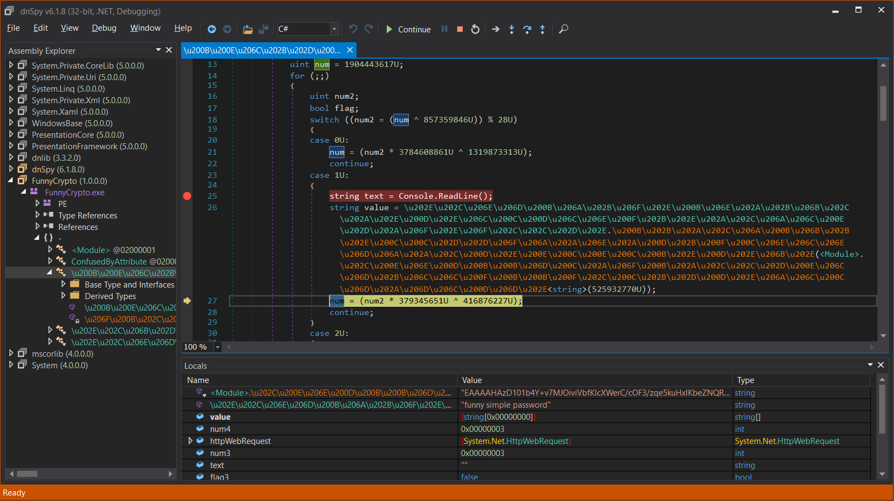
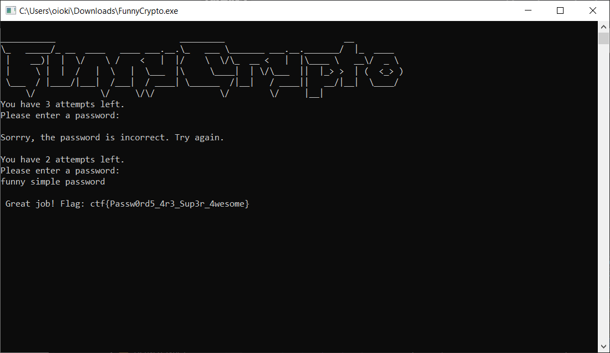

# Day 10. This is fun

> Try to find the funny passphrase which will give you the flag.

[FunnyCrypto.exe](./FunnyCrypto.exe)

## Solution

This is a .NET compiled program. It reads the standard input, compares with some predefined password, and if it matches, should print out the flag.

We can decompile the program and even debug it in runtime. For example, using [dnSpy](https://github.com/dnSpy/dnSpy/releases). Just put the breakpoint on the input, enter something random, do a few debugging steps and observe the correct password in local variables (`funny simple password`). Thanks to debugger:



Now we just need to type this password, and get the flag:



```
ctf{Passw0rd5_4r3_Sup3r_4wesome}
```
