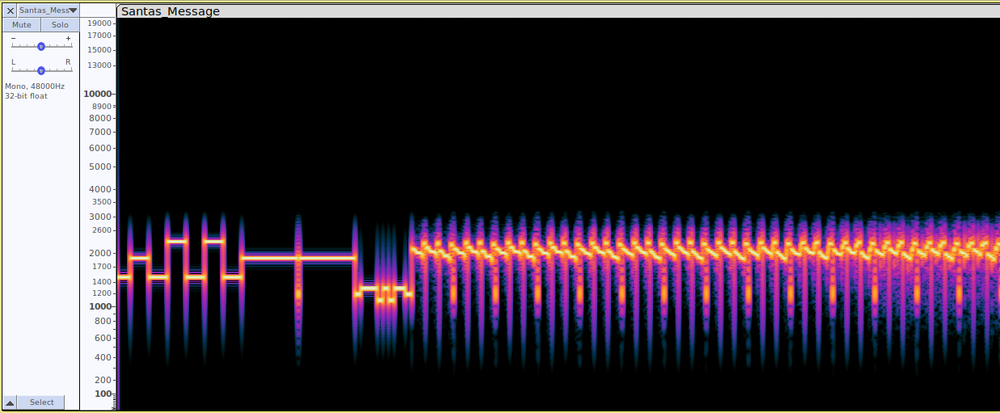
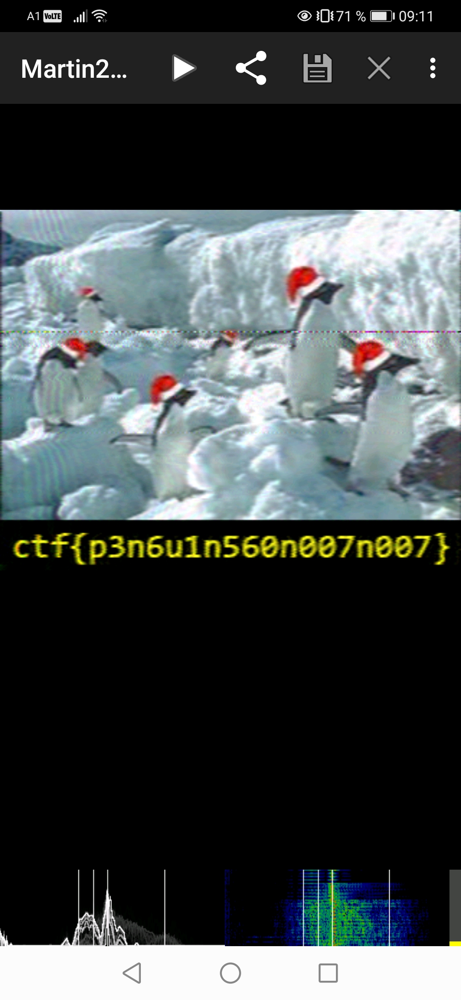

# Day 12. Santa's radio transmission

> This year, Santa decided to update his message delivery system from regular mail to radio transmissions.This way he can broadcast messages to all the children in the world at once. But since all the modern satellites are already in use by NASA, he had to use an old one he bought from eBay. Technology used is a bit outdated, but it still works like a charm! Can you decode Santa's radio transmission?

[Santas_Message.wav](./Santas_Message.wav)

## Solution

One good way of dealing with WAV files is to open them in [Audacity](https://www.audacityteam.org/) and select Spectrogram mode:



There are some discrete tones at the beginning, followed by some repeated pattern. You might spend some time wondering what is that, but this time it was useful to know it is [SSTV](https://en.wikipedia.org/wiki/Slow-scan_television).

[Robot36](https://play.google.com/store/apps/details?id=xdsopl.robot36) is a decent program to decode SSTV pictures.

Start this program, put your mobile phone next to the laptop, press Play in the Audacity and observe the transmitted image:



And the flag is:

```
ctf{p3n6u1n560n007n007}
```
