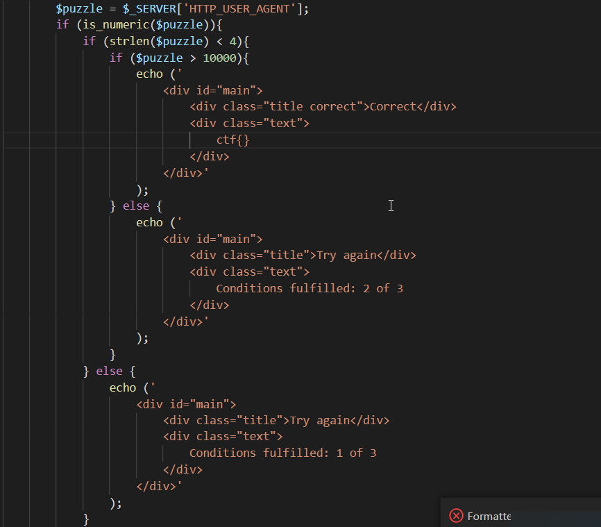

# Day 13. Santa's puzzle

> Santa has some trouble solving a puzzle found on this webpage: https://naughty.owasp.si/deployed/christmas-puzzle/. Can you help him find the anwser?



## Solution

Basically, we need to provide a number big enough to pass condition `>10000` but having a length of `3` in textual representation.

The scientific notation satisfies that:

```
$ curl -H 'User-Agent: 1e9' -s https://naughty.owasp.si/deployed/christmas-puzzle/ | grep ctf
                                ctf{then1ghtB3fore}
```
