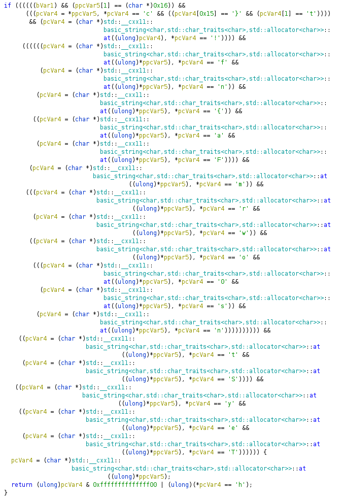

# Day 15. Santa's old program

> Santa found his old program, which contains a secret. Can you help him retrieve it? Flag is right input!

[check](./check)

## Solution

Open the executable in [Ghidra](https://ghidra-sre.org/). Apart from the other stuff, there was an interesting piece of code:



See [isValid.cpp](./isValid.cpp) for the reference.

I did not spend much time figuring out what is happening here, but the flag was almost immediately visible between the lines:

```
ctf{FrostyTheSn0wman!}
```
