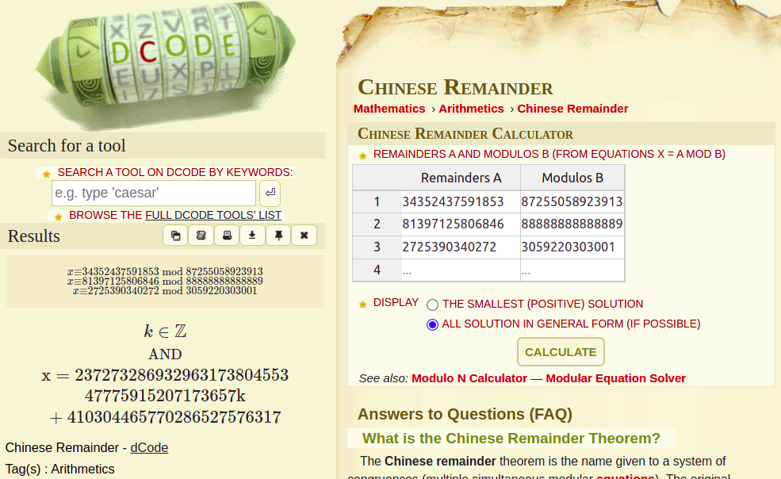
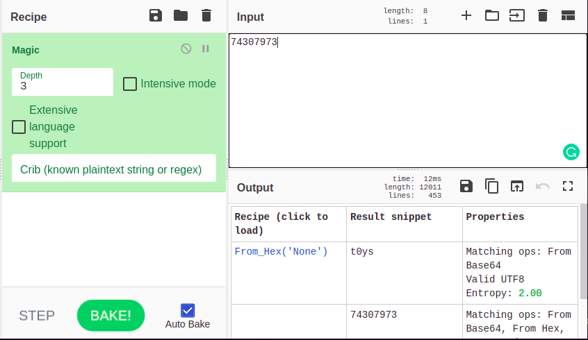

# Day 20. Santa's encrypted message

> Santa received an encrypted message with following data: 87255058923913 88888888888889 3059220303001

> Cipher texts: 34352437591853 81397125806846 2725390340272

> Can you help Santa to decrypt the message? (Wrap result with ctf{})

## Solution

The challenge is clearly about cryptography. Let's figure out the properties of given numbers. Turns out the first three given numbers are primes:

```
$ factor 87255058923913 88888888888889 3059220303001
87255058923913: 87255058923913
88888888888889: 88888888888889
3059220303001: 3059220303001
```

Let's label them as `p`, `q`, `r`.

The other three numbers are however not primes. It was not clear what to do next, so I tried several approaches. My primary assumption was that the challenge was about [RSA](https://en.wikipedia.org/wiki/RSA_(cryptosystem)) because this system relies heavily on prime numbers. The main equation of the RSA is:

```
m^e mod n = c
```

where `m` is the original message, `e` is a public exponent (usually 65537 for practical reasons, but could be almost any number), `n` is an encryption key, `c` is ciphertext. `X mod Y` is the operation of taking the remainder of a division `X` by `Y`.

Later this day, organizers released a hint:

> Chinese Remainder Theorem - e = 3

In my opinion, `e = 3` hint would be enough. This would clearly tell us that the challenge is about RSA and would eliminate the need of guessing the exponent.

Now, having all pieces together, we can write down the equations, assuming the original message has been the same for all three cases:

```
m^3 mod 87255058923913 = 34352437591853
m^3 mod 88888888888889 = 81397125806846
m^3 mod 3059220303001  = 2725390340272
```

We have a system of modular equations with `m^3` as an unknown. [Chinese remainder theorem](https://en.wikipedia.org/wiki/Chinese_remainder_theorem) is the standard approach in solving this kind of problems. There are even online tools where you can plug in your numbers and get a solution. [dcode.fr](https://www.dcode.fr/chinese-remainder) is one such a great website:



Great! We have a general solution of this form:

```
x = 23727328693296317380455347775915207173657 * k + 410304465770286527576317
```

The smallest solution is when `k=0`, i.e. `410304465770286527576317`, and it is a precise cube of integer:

```
>>> 410304465770286527576317**(1/3)
74307972.99999993
>>> 74307973**3 == 410304465770286527576317
True
```

Remember, the unknown was `m^3`, so `m = 74307973` was actually a solution.

Here I became a prisoner of my past experience. This number `74307973` looked weird to me, because I expected the flag to contain many more bytes, and the number should be a long integer. So, this time I tried to convert it in a usual way, and the result was meaningless:

```
>>> binascii.unhexlify('{:08x}'.format(74307973))
b'\x04m\xd9\x85'
```

I spent many hours trying to find other solutions with a larger `k`. Until I gave up and put the only solution to [CyberChef](https://gchq.github.io/CyberChef/#recipe=Magic(3,false,false,'')&input=NzQzMDc5NzM):



To my surprise, the flag was very short:

```
ctf{t0ys}
```

Have a look at [check.py](./check.py) which does modular arithmetics to prove the answer is correct.
