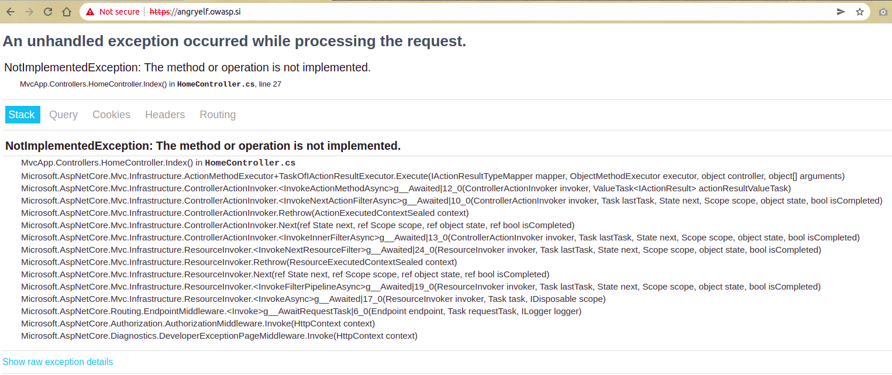
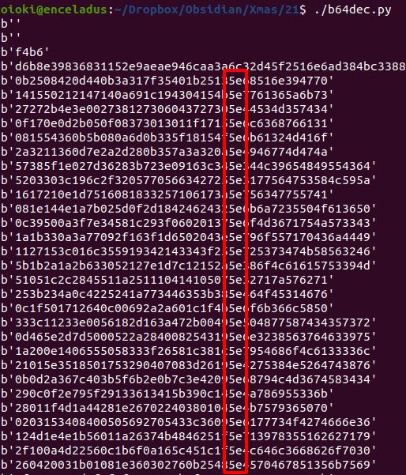

# Day 21. Santa's website issue

> Santa is trying to figure out which angry elf is doing some weird stuff. Can you try to monitor the site and figure it out?

https://angryelf.owasp.si/

## Solution

Click the link and see this error straight away:



The first step in web challenges is to understand the tech stack behind the challenge. Try to google some parts of the error message, you will see the (broken) website is running on .NET.

There is a slight hint in the challenge description, it mentions "monitor". So after some time I googled "dotnet monitor" and landed on this [blog post](https://devblogs.microsoft.com/dotnet/announcing-dotnet-monitor-in-net-6/).

Turns out dotnet monitor is a new tool to help debug .NET applications in runtime. It runs on a standard port `52323` and provides a few useful endpoints. See the blog post above for more details.

```
$ curl http://angryelf.owasp.si:52323/info
{"version":"6.0.0+9b21f76a1fff86a72ef1557f9fddc78695970332","runtimeVersion":"6.0.0","diagnosticPortMode":"Connect","diagnosticPortName":null}
```

There is `/logs` endpoint where we could see some interesting output. Seems like there is a `BackgroundProcessor` thread that prints the flag in some (encoded?) form:

```
2021-12-21 10:47:01Z warn: MvcApp.BackgroundProcessor[0]
      Executing N
2021-12-21 10:47:02Z warn: MvcApp.BackgroundProcessor[0]
      Executing Z
2021-12-21 10:47:03Z warn: MvcApp.BackgroundProcessor[0]
      Executing 0
2021-12-21 10:47:04Z warn: MvcApp.BackgroundProcessor[0]
      Executing w
2021-12-21 10:47:04Z info: MvcApp.Controllers.HomeController[0]
      => RequestId:0HME4AM8RIE6A:00000002, RequestPath:/ => ActionId:bb7b8136-8693-4168-b2e7-ae9506efd63e, ActionName:MvcApp.Controllers.HomeController.Index (MvcApp)
      Not implemented. q
2021-12-21 10:47:05Z warn: MvcApp.BackgroundProcessor[0]
      => RequestId:0HME4AM8RIE6A:00000002, RequestPath:/
      Executing j
2021-12-21 10:47:06Z warn: MvcApp.BackgroundProcessor[0]
      => RequestId:0HME4AM8RIE6A:00000002, RequestPath:/
      Executing G
2021-12-21 10:47:07Z warn: MvcApp.BackgroundProcessor[0]
      => RequestId:0HME4AM8RIE6A:00000002, RequestPath:/
      Executing j
```

This was fruitless though, so I jumped to `/dump` endpoint. This endpoint lets you download the [dump](./dump.zip) which has been created some time in the past based on some condition. For this challenge, creators made it static, i.e. the dump is always the same for everyone.

I spent a hell lot of hours trying to get something out of this dump:

* Tried to do some stackwalking using `dotnet-dump analyze`. There are 19 threads in this dump, but no luck there.
* I tried to use [foremost](https://www.kali.org/tools/foremost/) to extract [dll](output/dll/00349192.dll)/[exe](output/exe/00382912.exe) from the dump. There are some parts of these files, but significant parts are corrupted (data absent or zeroed).

My main idea was: straightforward way to solve this would be to get the code from the dump somehow, disassemble and figure out how the sequence is generated and recover flag from there.

.NET programs tend to store some information in UTF-16 encoding, so I wrote [a quick helper script](./every2.py) to extract every odd/even byte from the dump.

```
$ ./every2.py dump 
$ strings dump.0 > dump.0.str
```

In the even bytes of the dump, there are lot of string lines that look like base64-encoded, but decoding them do not produce anything readable at first sight:

```
$ echo -n 'FBVQISFHFAppHBlDBBVLXndhNlprcw==' | base64 -d | hexdump -C
00000000  14 15 50 21 21 47 14 0a  69 1c 19 43 04 15 4b 5e  |..P!!G..i..C..K^|
00000010  77 61 36 5a 6b 73                                 |wa6Zks|
```

There are plenty of them, actually. Just those matching regex `==$`, there are 1599 of them:

```
$ grep -c '==$' dump.0.str 
1599

$ grep '==$' dump.0.str > dump.0.eq
```

See [dump.0.eq](./dump.0.eq) for the reference. These lines are approximately of the same length, so let's try to decode them with another [helper script](./b64dec.py):



There is something common in this data: `0x5e` is the ASCII code for `^` which is also an operator sign for XOR operation.

Try harder, for example, with the Base64-encoded string above:

```
>>> chr(0x14^0x77)
'c'
>>> chr(0x15^0x61)
't'
>>> chr(0x50^0x36)
'f'
>>> chr(0x21^0x5a)
'{'
>>> chr(0x21^0x6b)
'J'
>>> chr(0x47^0x73)
'4'
>>> chr(0x14^0x77)
'c'
>>> chr(0x0a^0x61)
'k'
>>> chr(0x69^0x36)
'_'
>>> chr(0x1c^0x5a)
'F'
>>> chr(0x19^0x6b)
'r'
>>> chr(0x43^0x73)
'0'
>>> chr(0x04^0x77)
's'
>>> chr(0x15^0x61)
't'
>>> chr(0x4b^0x36)
'}'
```

The flag is:

```
ctf{J4ck_Fr0st}
```

This challenge is quite guessy to my opinion, but maybe I did not found an intended solution (via disassembly or something). If you know the proper way, please [let me know](https://twitter.com/oioki).
