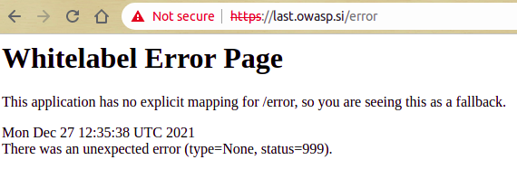

# Day 24. Saved the best for last

> Santa keeps track of your wishes. So he prepared something special for the last day. At this point, he would also like to thank all of the sponsors and you as community supporters!

Stay safe! Keep h@ck1ng and R0ck1ng! https://last.owasp.si/

## Solution (unintended)

Sorry to disappoint, but I used likely unintended solution. However, I did not know what is the intended solution, so `¯\_(ツ)_/¯`

We are presented with [index.html](./index.html) with only a [left part of the image](resources/images/left.png) with printed beginning of the flag `ctf{lastBu`. It was worth trying `ctf{lastButNotLeast}` and `ctf{lastButTheBest}` but they were incorrect.

The right part of the image is said to be hosted on http://65.108.146.8/right.png. However, if you try to open it, it will show you the standard `403 Forbidden` nginx page.

Seems like the challenge was about bypassing some IP address protection, and to get the flag, we need somehow to exploit the application. One of the interesting endpoints I discovered was `/error`:



Google this error message, and you realize that we are dealing with the application based on [Spring Boot](https://spring.io/projects/spring-boot) framework.

What I tried at this point without any result:

* Enumerate application endpoints with [ffuf](https://github.com/ffuf/ffuf) and a decent [wordlist](https://github.com/danielmiessler/SecLists/blob/master/Discovery/Web-Content/big.txt).
* Bypass IP address protection with `X-Forwarded-For` HTTP headers and alike.
* Nginx LFI via path traversal, see [blog post](https://www.acunetix.com/vulnerabilities/web/path-traversal-via-misconfigured-nginx-alias/) in attempt to leak application source code.
* Since the application is written in Java, there is a chance it is vulnerable to recent [log4j](https://cve.report/CVE-2021-44228) vulnerability.

Suddenly, I recalled that in [Day 3](../03/README.md) we had an application with wide possibilities, including [RCE](https://en.wikipedia.org/wiki/Arbitrary_code_execution). `naughty.owasp.si` was hosted on the same server as `last.owasp.si`, therefore IP address matched.

The [solution](./solution.py) was as easy as running remotely:

```
curl -s http://65.108.146.8/right.png 2>&1 | base64
```

and decoding it with:

```
$ ./solution.py | base64 -d > right.png
```


The full flag is therefore:

```
ctf{lastBuThankYouForPlaying}
```

## Solution (intended)

If you know how this challenge was supposed to be solved, please [let me know](https://twitter.com/oioki).
